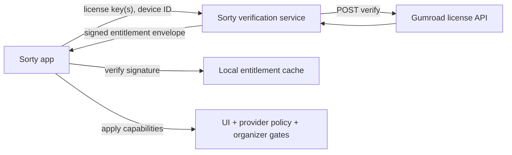

# Gumroad Verification Service Architecture

This document describes the intended production shape for Sorty's Gumroad-backed entitlement verification.

## Goals

- No Gumroad seller secret inside the macOS app.
- Local verification of signed entitlements in the client.
- Encrypted local cache for offline tolerance.
- Good-faith seat enforcement for an open repository model.
- One capability system shared by UI, provider gating, and runtime enforcement.

## Architecture



## Why a service exists

Gumroad license verification is seller-side. In an open repository app, embedding seller secrets or trusting unsigned client-only responses is weak. The service narrows trust to:

- Gumroad verification on the server
- server-side seat bookkeeping
- signed entitlement payloads

The app only needs the public signing key.

## Contract

### `POST /v1/activate`

Input:

```json
{
  "licenseKeys": ["ABCD-1234-EFGH-5678"],
  "device": {
    "deviceID": "stable-device-id",
    "deviceName": "Shirish's MacBook Pro",
    "appVersion": "1.2.0"
  },
  "reason": "activate"
}
```

Output:

```json
{
  "envelope": {
    "algorithm": "ES256",
    "keyID": "sorty-license-key-v1",
    "payload": "<base64-json>",
    "signature": "<base64-der-signature>"
  }
}
```

### `POST /v1/refresh`

Same input shape as activation. Refresh re-validates stored keys and updates seat timestamps.

### `POST /v1/deactivate`

```json
{
  "licenseKeys": ["ABCD-1234-EFGH-5678"],
  "deviceID": "stable-device-id"
}
```

This releases the current Mac from the seat registry.

## Client verification

The app:

1. decodes the envelope payload
2. verifies the `ES256` signature with the pinned public key
3. decodes the payload into `LicenseEntitlementPayload`
4. updates `EntitlementManager`
5. encrypts and stores the envelope locally

## Cache and grace behavior

- Cached entitlement envelopes are encrypted with AES-GCM.
- The AES key is stored in Keychain.
- Stored license keys are kept in Keychain.
- If refresh fails but the cached signed payload is still inside the grace window, Sorty enters `.grace`.
- After grace expires, Sorty downgrades to `.expired`, which resolves to free-core capability rules.

## Seat policy

- Default seat limit: 3 devices per purchased entitlement.
- Seat bookkeeping is server-side.
- Re-activating on the same device updates `lastSeenAt`.
- Activating on a new device past the seat limit returns a conflict so the user can release another seat first.

## SKU mapping

The service owns the authoritative Gumroad `product_id -> Sorty SKU -> entitlement set` mapping.

That prevents drift between:

- Gumroad products
- in-app labels
- runtime capability checks

## Production hardening checklist

- store seat registry in durable storage, not ephemeral disk
- add auth/rate limiting between the app and service
- log verification outcomes without storing raw license keys
- rotate signing keys with explicit `keyID` versioning
- monitor Gumroad verification failures and seat-conflict rates
- keep commercial-license operations and Gumroad SKU mapping under admin-only control

